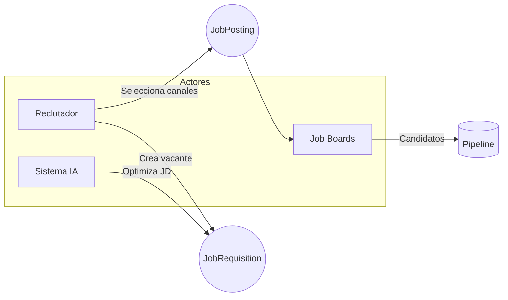
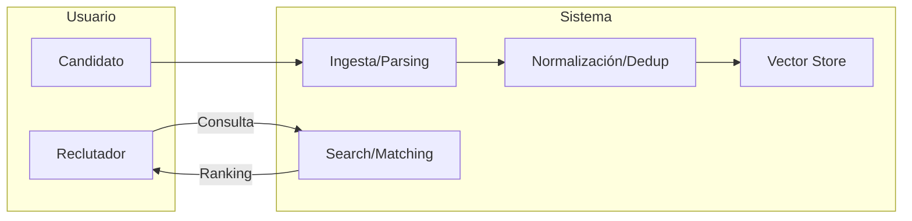
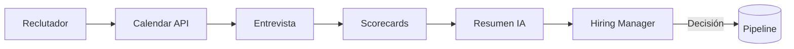
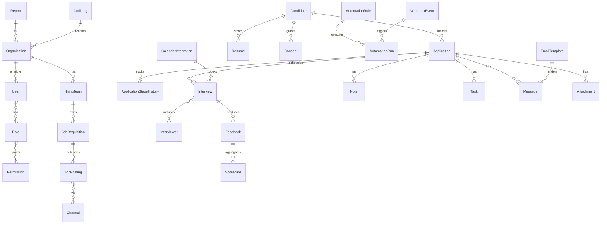
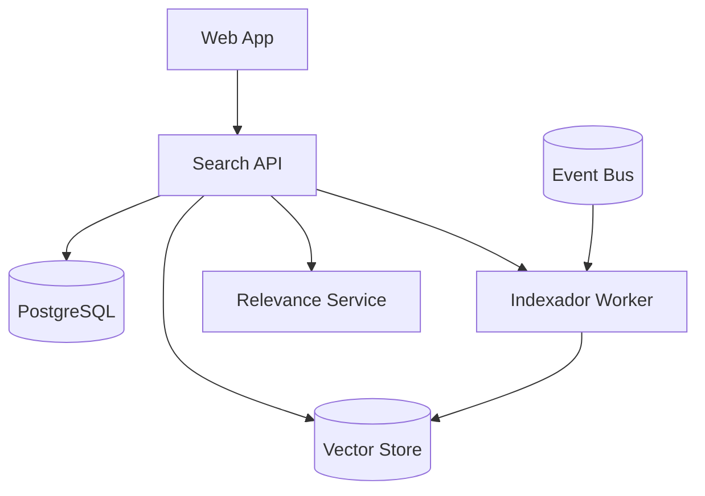
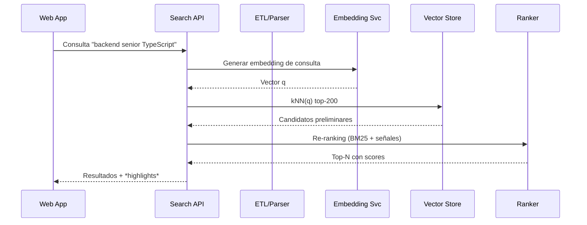

# LTI – AS

## 1. Resumen ejecutivo
LTI ATS v1 es un sistema de seguimiento de candidatos (ATS) diseñado para equipos de reclutamiento y hiring managers que buscan acelerar el time-to-hire, mejorar la colaboración en tiempo real y automatizar tareas críticas. La v1 entrega publicación multicanal, ingesta y normalización de CVs con búsqueda semántica, pipeline visual colaborativo, entrevistas con integración de calendario, feedback estructurado, automatizaciones declarativas y reportes básicos. Cumple mínimos de privacidad (consentimiento y retención) y auditoría. Arquitectura modular (Core Recruiting, Search/Matching, Automation, Collaboration, Reporting) con almacenamiento relacional + vector store.

**Propuesta de valor / ventajas competitivas**
- **Velocidad operativa**: pipelines, plantillas y automatizaciones “no-code” reducen *time-to-hire* 25–40% (objetivo v1).
- **IA práctica**: parsing + embeddings + resúmenes contextuales para hiring managers; JD assistant y Q&A candidatos.
- **Colaboración nativa**: comentarios con *@mentions*, tareas y SLA visibles por etapa.
- **Interoperabilidad**: APIs, webhooks y conectores (calendario, email, job boards) desde v1.
- **Cumplimiento by design**: consentimiento, retención configurable (p. ej., 12 meses) y auditoría completa.

**Riesgos y supuestos**
1. **Disponibilidad de datos**: CVs y fuentes externas con calidad variable. *Mitigación*: normalización y validadores.
2. **Sesgos de IA**: riesgo en screening automático. *Mitigación*: controles humanos, explicabilidad y límites.
3. **Adopción**: resistencia a cambio. *Mitigación*: onboarding guiado, plantillas y KPIs visibles.
4. **Integraciones**: dependencia de APIs de terceros. *Mitigación*: adapters y colas con reintentos.
5. **Privacidad**: gestión de consentimiento por región. *Mitigación*: políticas y borrado/anonimización programables.

---

## 2. Investigación y análisis

**Contexto del mercado ATS — hallazgos clave**
1. **Eficiencia**: los ATS líderes priorizan automatización de tareas repetitivas (parsing, plantillas, programación de entrevistas).
2. **Colaboración**: hiring colaborativo con *scorecards*, comentarios y móviles nativos.
3. **Automatización**: reglas por triggers (estado, evento, etiqueta) y envío multicanal.
4. **IA aplicada**: búsqueda semántica, ranking y asistentes para JD/plantillas/QA.
5. **Cumplimiento**: GDPR/LOPD, retención y auditoría granular son *must-haves*.
6. **Analítica**: dashboards operativos con funnel, SLA y contribución por fuente.
7. **Multiposting**: publicación a múltiples job boards y *careers site* embebido.

**Benchmark rápido**

| Producto | Segmento | 3 Features distintivas | Gaps que LTI puede aprovechar |
|---|---|---|---|
| Greenhouse | Mid–Enterprise | Estructura de entrevistas/scorecards; ecosistema de integraciones; workflows avanzados | Coste/implementación alta complejidad; pricing opaco; IA aún acotada en v1 |
| Lever | Mid-market | CRM + ATS integrado; pipelines flexibles; analítica de ofertas | Profundidad de búsqueda semántica limitada de fábrica; personalización avanzada = servicios |
| Ashby | Startups → Mid | Analítica potente; UX moderna; automatizaciones cuidadas | Precio para equipos pequeños; cobertura de job boards fuera de EEUU puede requerir partners |
| Workable | SMB–Mid | Multiposting amplio; programación entrevistas sencilla; apps móviles | Reportes avanzados y personalización enterprise limitados en planes base |
| Teamtailor | SMB–Mid | Employer branding/career site nativo; flujos visuales; marketplace de integraciones | Profundidad de reporting/BI; controles de cumplimiento avanzados por región |

**KPIs iniciales (medibles desde v1)**
- **Time-to-hire (mediana)** por vacante y por fuente.
- **Offer acceptance rate** (%).
- **Cost per hire** (USD/MXN) por canal.
- **Quality of hire (proxy)**: score promedio post-onboarding (NPS interno) y performance a 90 días (si disponible).
- **% automatizaciones ejecutadas** sobre total de acciones manuales equivalentes.
- **SLA de respuesta candidatos** (p95 horas entre cambio de etapa y contacto).
- **Tasa de cumplimiento de consentimiento/retención** (% candidatos con consentimiento vigente).

---

## 3. Lean Canvas (modelo de negocio)

| Bloque | Contenido |
|---|---|
| **Problema** | - Procesos manuales y dispersos.\- Falta de colaboración y visibilidad en tiempo real.\- Cumplimiento y auditoría deficientes. |
| **Segmentos de clientes** | - Startups y pymes tecnológicas (10–500 empleados).\- Escala-ups con 5–30 vacantes activas.\- Agencias boutique con foco en tech. |
| **Propuesta de valor** | - Reducir *time-to-hire* 25–40%.\- IA práctica para screening y resúmenes.\- Cumplimiento y auditoría *by design*. |
| **Solución** | - ATS modular con multiposting, search semántico, pipeline colaborativo, automatizaciones y analytics MVP. |
| **Canales** | - Ventas *product-led* (trial).\- Partnerships con job boards y HRIS.\- Marketplace de integraciones. |
| **Flujo de ingresos** | - Suscripción SaaS por *seats* y *vacantes activas*.\- Add-ons (analytics avanzado, SSO/SCIM, sandbox). |
| **Estructura de costes** | - Infra cloud (DB, colas, vector).\- Desarrollo/soporte.\- Cumplimiento/seguridad.\- Integraciones. |
| **Métricas clave** | - Activaciones, vacantes creadas, candidatos procesados, % automatizaciones, *time-to-hire*. |
| **Ventaja injusta** | - Plantillas/automatizaciones *opinionated* por rol.\- UX enfocada en decisiones.\- Arquitectura lista para IA y auditoría. |

---

## 4. Funciones principales (MVP v1)

### 4.1 Gestión de vacantes y publicación multicanal
- **User story**: Como *Reclutador* quiero crear una vacante con plantillas y publicarla en múltiples canales para atraer candidatos rápidamente.
- **Criterios (G/W/T)**: *Given* una vacante con JD y permisos correctos, *When* publico, *Then* se crea un `JobPosting` por canal con tracking de fuente y estado.
- **Automatizaciones/IA**: JD assistant (redacción/resumen), sugerencia de tags y canales.
- **Métricas**: tiempo a publicar, candidatos por fuente, CTR por canal.

### 4.2 Ingesta y normalización de CVs + deduplicación + búsqueda semántica
- **User story**: Como *Reclutador* quiero importar CVs desde email/archivos/form para centralizar y buscar semánticamente.
- **Criterios**: *Given* un CV, *When* se ingesta, *Then* se parsea, normaliza y deduplica (`Application.dedupe_key`); embeddings a vector store.
- **Automatizaciones/IA**: parsing, *skill extraction*, embeddings, sinónimos/ontologías.
- **Métricas**: tasa de parsing correcto, recall@k en búsqueda, tasa de duplicados detectados.

### 4.3 Pipeline visual por etapas con colaboración y entrevistas
- **User story**: Como *Hiring Manager* quiero arrastrar candidatos entre etapas, comentar y programar entrevistas con mi calendario.
- **Criterios**: *Given* permisos, *When* muevo de etapa, *Then* se registra `Stage.Changed`, SLA y notificaciones; entrevistas bloquean horario vía Google/Microsoft.
- **Automatizaciones/IA**: sugerir próxima acción; proponer horarios óptimos.
- **Métricas**: tiempo por etapa, % entrevistas no-show, cumplimiento de SLA.

### 4.4 Evaluaciones y feedback estructurado
- **User story**: Como *Entrevistador* quiero scorecards estandarizados para comparar candidatos objetivamente.
- **Criterios**: *Given* una entrevista, *When* envío feedback, *Then* se valida completitud y se actualiza `Application.score` con pesos.
- **Automatizaciones/IA**: resúmenes de entrevistas y *highlights*; detección de sesgos (palabras prohibidas).
- **Métricas**: latencia de feedback, cobertura de scorecards, correlación score ↔ oferta.

### 4.5 Automatizaciones
- **User story**: Como *Reclutador* quiero reglas *no-code* para etiquetar, enviar emails y mover etapas según eventos.
- **Criterios**: *Given* regla activa, *When* se dispare el trigger, *Then* acciones se encolan y ejecutan con auditoría (`AutomationRun`). 
- **Automatizaciones/IA**: plantillas con IA para emails personalizados; verificaciones (consent, documentos).
- **Métricas**: % acciones automatizadas, fallos/reintentos, ahorro de tiempo estimado.

### 4.6 Asistencia de IA
- **User story**: Como *Hiring Manager* quiero resúmenes del perfil y *fit* con la vacante para decidir rápido.
- **Criterios**: *Given* candidatura, *When* abro panel IA, *Then* veo resumen, *fit score*, riesgos y preguntas sugeridas.
- **Automatizaciones/IA**: JD assistant, sourcing semántico, screening Q&A, *fit scoring* explicable.
- **Métricas**: tiempo de revisión, precisión percibida (CSAT), adopción del asistente.

### 4.7 Permisos y auditoría
- **User story**: Como *Admin* quiero RBAC por organización/equipo con auditoría completa.
- **Criterios**: *Given* acción sensible, *When* se ejecuta, *Then* `AuditLog` registra quién/cuándo/qué y verifica consentimiento.
- **Automatizaciones/IA**: enmascaramiento de PII en entornos no productivos.
- **Métricas**: incidentes de acceso, cumplimiento de retención.

### 4.8 Reportes y Analytics (MVP)
- **User story**: Como *Líder de HR* quiero un dashboard de funnel y SLA para detectar cuellos de botella.
- **Criterios**: *Given* filtros por fecha/rol/fuente, *When* consulto, *Then* veo métricas y puedo exportar CSV.
- **Automatizaciones/IA**: *insights* explicativos (p. ej., “la etapa técnica demora 3× más”). 
- **Métricas**: uso del tablero, tiempo por etapa, conversión por fuente.

---

## 5. Casos de uso (3 principales)

### Caso 1: Publicación de vacante y multiposting
**Descripción**: El reclutador crea una `JobRequisition` usando plantilla, el asistente de IA optimiza el JD y se publica en varios canales con tracking UTM. Se inicia el funnel con métricas por fuente.
**Actores**: Reclutador, Sistema IA, Job Boards.
**Flujo principal**:
1. Crear `JobRequisition` (plantilla).
2. IA sugiere mejoras y tags.
3. Seleccionar canales; generar `JobPosting` + tracking.
4. Publicar y programar actualización automática.
5. Recibir candidatos y abrir pipeline.
**Alternativos**: Falla canal → reintento/cola; rechazo legal del JD → revisión.

**Diagrama**


### Caso 2: Ingesta de CV y búsqueda semántica
**Descripción**: Un candidato aplica; el sistema parsea, normaliza, deduplica y genera embeddings para búsqueda/ranking. El reclutador busca por habilidades sinónimas.
**Actores**: Candidato, Reclutador, Servicio de Search/Matching.
**Flujo principal**:
1. Recepción CV → `Resume.Parsed`.
2. Normalización + `Application.Deduped`.
3. Embeddings → Vector Store.
4. Reclutador realiza consulta semántica.
5. Servicio responde con ranking y *highlights*.
**Alternativos**: Parsing pobre → revisión manual; conflicto de duplicado → merge asistido.

**Diagrama**


### Caso 3: Entrevista y feedback estructurado
**Descripción**: Con base en el pipeline, se agenda entrevista integrada a calendario; entrevistadores completan scorecards y el sistema genera un resumen para decidir.
**Actores**: Reclutador, Hiring Manager, Entrevistador(es), Calendar API, Sistema IA.
**Flujo principal**:
1. Propuesta de horarios → integración calendario.
2. Confirmación → `Interview.Scheduled`.
3. Ejecución → envío de scorecards.
4. IA genera resumen y *fit score*.
5. Decisión: avanzar, oferta o rechazo con email.
**Alternativos**: No-show → reprogramación; feedback incompleto → recordatorios automáticos.

**Diagrama**


---

## 6. Modelo de datos (ERD + diccionario)

**ERD**


**Diccionario de datos (extracto clave)**

- **User**: id(UUID, PK, único); org_id(FK Organization, idx); email(string, único, idx); full_name(string); status(enum: active|inactive); created_at(datetime, idx); created_by(UUID); updated_at(datetime).
- **Role**: id(UUID, PK); name(string, único); description(text).
- **Permission**: id(UUID, PK); key(string, único, idx); description(text).
- **Organization**: id(UUID, PK); name(string, único, idx); region(string); retention_months(int, default 12); created_at(datetime).
- **HiringTeam**: id(UUID, PK); org_id(FK, idx); name(string); members(jsonb: user_ids, idx GIN).
- **JobRequisition**: id(UUID, PK); team_id(FK, idx); title(string, idx full-text); department(string); location(string); employment_type(enum); description(text); status(enum: draft|open|paused|closed); created_at(datetime); created_by(UUID).
- **JobPosting**: id(UUID, PK); job_id(FK, idx); channel_id(FK, idx); url(string); external_ref(string, único?); status(enum: draft|published|archived); posted_at(datetime).
- **Channel**: id(UUID, PK); name(string, único); type(enum: job_board|career_site|referral|agency|other); config(jsonb).
- **Candidate**: id(UUID, PK); full_name(string, idx); email(string, único, idx); phone(string); location(string); headline(string); experience_years(int); skills(jsonb, GIN); consent_status(enum: granted|revoked|expired, idx); consent_expires_at(datetime, idx); created_at(datetime, idx); created_by(UUID); updated_at(datetime).
- **Application**: id(UUID, PK); candidate_id(FK, idx); job_id(FK, idx); source(enum); status(enum: new|screening|interview|offer|hired|rejected, idx); stage(string, idx); score(decimal(5,2), idx); tags(jsonb, GIN); dedupe_key(string, idx unique where active); created_at(datetime, idx); updated_at(datetime).
- **Resume**: id(UUID, PK); candidate_id(FK, idx); file_url(string); text(text); parsed_json(jsonb, GIN); language(string); hash(string, idx unique).
- **Attachment**: id(UUID, PK); application_id(FK, idx); type(string); file_url(string); created_at(datetime).
- **Consent**: id(UUID, PK); candidate_id(FK, idx); scope(string); granted_at(datetime); expires_at(datetime, idx); revoked_at(datetime, nullable).
- **Stage**: id(UUID, PK); org_id(FK, idx); name(string); order(int, idx); default_sla_hours(int).
- **ApplicationStageHistory**: id(UUID, PK); application_id(FK, idx); from_stage(string); to_stage(string); changed_at(datetime, idx); changed_by(UUID); notes(text).
- **Interview**: id(UUID, PK); application_id(FK, idx); scheduled_start(datetime, idx); scheduled_end(datetime); location(string); conferencing_link(string); status(enum: proposed|scheduled|completed|no_show|canceled, idx).
- **Interviewer**: id(UUID, PK); interview_id(FK, idx); user_id(FK User, idx); role(string).
- **Feedback**: id(UUID, PK); interview_id(FK, idx); reviewer_id(FK User, idx); submitted_at(datetime, idx); summary(text); overall_recommendation(enum: strong_no|no|neutral|yes|strong_yes, idx).
- **Scorecard**: id(UUID, PK); feedback_id(FK, idx); rubric(jsonb); score(decimal(5,2), idx); weights(jsonb).
- **AutomationRule**: id(UUID, PK); org_id(FK, idx); name(string); trigger(enum/event, idx); conditions(jsonb, GIN); actions(jsonb); enabled(bool, idx).
- **AutomationRun**: id(UUID, PK); rule_id(FK, idx); event_id(FK WebhookEvent, nullable); status(enum: queued|running|success|failed, idx); started_at(datetime); finished_at(datetime); logs(text).
- **WebhookEvent**: id(UUID, PK); topic(string, idx); payload(jsonb, GIN); received_at(datetime, idx); signature(string).
- **Note**: id(UUID, PK); application_id(FK, idx); author_id(FK User, idx); text(text); mentions(jsonb, GIN); created_at(datetime, idx).
- **Mention**: id(UUID, PK); note_id(FK, idx); user_id(FK, idx); created_at(datetime).
- **Task**: id(UUID, PK); application_id(FK, idx); assignee_id(FK User, idx); title(string); due_at(datetime, idx); status(enum: open|done|canceled, idx).
- **EmailTemplate**: id(UUID, PK); org_id(FK, idx); name(string, único); subject(string); body(text); placeholders(jsonb).
- **Message**: id(UUID, PK); application_id(FK, idx); direction(enum: inbound|outbound, idx); channel(enum: email|sms|other, idx); subject(string); body(text); sent_at(datetime, idx); provider_id(string).
- **CalendarIntegration**: id(UUID, PK); org_id(FK, idx); provider(enum: google|microsoft); tenant(jsonb); scopes(jsonb); created_at(datetime).
- **Report**: id(UUID, PK); org_id(FK, idx); name(string); definition(jsonb); created_at(datetime).
- **AuditLog**: id(UUID, PK); org_id(FK, idx); actor_id(FK User, idx); entity(string, idx); entity_id(UUID, idx); action(string, idx); at(datetime, idx); metadata(jsonb, GIN).

**Índices críticos**
- Full-text (`JobRequisition.title`, `Resume.text`), trigram para búsqueda difusa en nombres/emails.
- `pgvector` para embeddings en `Resume`/`Candidate`/`Application`.
- Índices parciales por `status`, `consent_status`, `stage` y `org_id`.

---

## 7. Diseño de sistema (alto nivel)

**Arquitectura**: servicios modulares MVS: Core Recruiting, Search/Matching, Automation, Collaboration, Reporting, Integrations. API Gateway con autenticación (JWT/SSO), DB relacional (PostgreSQL + pgvector), colas (Redis/RabbitMQ), Event Bus (Kafka/NATS), object storage y servicios de IA (embeddings/resumen).

**Diagrama**
```mermaid
graph TD
  subgraph Frontend
    W[Web App (React)]
  end
  subgraph Backend
    APIGW[API Gateway/GraphQL+REST]
    CORE[Core Recruiting Service]
    SRCH[Search & Matching]
    AUTO[Automation Engine]
    COLLAB[Collaboration/Comments]
    RPT[Reporting API]
    INTEG[Integrations (Email/Cal/Boards)]
  end
  subgraph Data
    PG[(PostgreSQL)]
    VEC[(Vector Store pgvector)]
    Q[(Queue)]
    BUS[(Event Bus)]
    OBJ[(Object Storage)]
    LOGS[(Observability: Logs/Metrics/Traces)]
  end
  W --> APIGW
  APIGW --> CORE --> PG
  APIGW --> SRCH --> VEC
  APIGW --> AUTO --> BUS
  APIGW --> COLLAB --> PG
  APIGW --> RPT --> PG
  APIGW --> INTEG --> Q
  INTEG -->|Email/SMTP, Graph| EXT1[Email]
  INTEG -->|Google/Microsoft| EXT2[Calendar]
  INTEG -->|Job Boards APIs| EXT3[Boards]
  BUS --> AUTO
  CORE --> BUS
  SRCH --> BUS
  COLLAB --> BUS
  RPT --> LOGS
```

**Integraciones**: Google/Microsoft Calendar; Email (SMTP/Graph); Job boards; SSO/OAuth2; Webhooks entrantes/salientes.

**No funcionales (NFRs)**
- **Seguridad**: RBAC por organización/equipo; cifrado en tránsito/descanso; auditoría.
- **Privacidad**: consentimiento explícito; retención configurable; derecho al olvido/exportación.
- **Escalabilidad**: servicios independientes; colas y *horizontal scaling*.
- **Disponibilidad**: SLA 99.5% v1; *graceful degradation* sin IA.
- **Observabilidad**: métricas de colas, latencias, errores; tracing distribuido.
- **Rendimiento**: P95 < 300 ms para operaciones CRUD; P95 < 1.2 s consultas semánticas.
- **Accesibilidad**: WCAG 2.1 AA.

**Eventos de dominio clave**
`Candidate.Consented`, `Resume.Parsed`, `Application.Deduped`, `Application.Created`, `Stage.Changed`, `Interview.Scheduled`, `Feedback.Submitted`, `Offer.Sent`, `Offer.Accepted`, `AutomationRule.Fired`, `AutomationRun.Completed`, `Message.Sent`, `Audit.Recorded`.

---

## 8. Diagrama C4 (componente: Search & Matching)

**C4-Context (resumen)**: El componente Search & Matching permite consultas semánticas y ranking de candidatos y vacantes mediante embeddings y señales de relevancia (texto, habilidades, seniority, etapa).

**C4-Container**


**C4-Component**
```mermaid
graph TD
  QP[Query Parser] --> ES[Embedding Service]
  ES --> VR[Vector Retriever]
  VR --> RS[Ranker (BM25 + Signals)]
  IDX[Indexer] --> ETL[Extractor/Normalizer]
  ETL --> ES --> VStore[(pgvector)]
  RS --> Resp[Response Builder]
```

**Secuencia crítica**


---

## 9. Roadmap y riesgos

**Backlog MVP (épicas)**
1. Core Recruiting CRUD + RBAC básico (**Done** cuando crea vacantes/candidatos y controla acceso).
2. Multiposting (5 canales iniciales) con tracking UTM.
3. Ingesta/Parsing CV + normalización + dedupe.
4. Vector Store + búsqueda semántica + ranking híbrido.
5. Pipeline Kanban + @mentions + tareas.
6. Entrevistas + integración Google/Microsoft Calendar.
7. Scorecards + feedback estructurado + agregación de score.
8. Automatizaciones no-code (triggers/conditions/actions) + auditoría.
9. Mensajería (email saliente) + plantillas + logs.
10. Reportes MVP (funnel, SLA, fuentes) + export CSV.
11. Cumplimiento: consentimiento, retención y derecho al olvido.
12. Observabilidad y seguridad (audit log, métricas, traces).

**Riesgos y mitigaciones**
- **Parsing CV variable** → *Fallback* manual y proveedores alternos.
- **Sesgos IA** → límites en decisiones automáticas y *review* humana.
- **Integraciones inestables** → colas y *circuit breakers*.
- **Escalado de búsqueda** → particionado/ANN y caching resultados.
- **Privacidad internacional** → configuración por región y plantillas legales.

**Métricas de éxito MVP**
- -25% *time-to-hire* en 90 días.\- ≥70% de acciones repetitivas automatizadas.\- SLA p95 respuesta < 48h.\- ≥80% adopción de scorecards.\- CSAT de hiring managers ≥ 4/5.

---

## 10. Apéndice

**Suposiciones / ADR corto**
- PostgreSQL + `pgvector` para simplificar operaciones y vector en un solo motor.
- ANN vía HNSW/IVFFlat según tamaño; Elasticsearch opcional v2.
- API GraphQL para lectura agregada + REST para webhooks.
- Infra cloud con despliegue contenedores; colas Redis inicialmente.

**Glosario**
- **ATS**: Applicant Tracking System.\
- **Multiposting**: publicación simultánea en múltiples portales.\
- **Scorecard**: formulario estandarizado de evaluación.\
- **Embedding**: vector numérico que representa texto para búsqueda semántica.\
- **RBAC**: control de acceso basado en roles.

**Referencias (consulta 19 de octubre de 2025)**
- Greenhouse – reseñas/recursos: [Forbes Advisor (Greenhouse Review)](https://www.forbes.com/advisor/business/software/greenhouse-review/); [Research.com (Greenhouse Review 2025)](https://research.com/software/reviews/greenhouse)
- Lever – sitio oficial y reseñas: [lever.co](https://www.lever.co/); [GetApp 2025](https://www.getapp.com/hr-employee-management-software/a/lever/)
- Ashby – sitio oficial y reseñas: [ashbyhq.com/platform/recruiting/ats](https://www.ashbyhq.com/platform/recruiting/ats); [G2 2025](https://www.g2.com/products/ashby-ashby/reviews)
- Workable – guías y reseñas: [Workable features overview](https://resources.workable.com/tutorial/important-applicant-tracking-system-features); [Skima.ai 2025](https://skima.ai/blog/product-deep-dives/workable-review)
- Teamtailor – sitio oficial y reseñas: [teamtailor.com/all-features](https://www.teamtailor.com/en-us/all-features/); [GetApp 2025](https://www.getapp.com/hr-employee-management-software/a/teamtailor/)

---

## Verificación de calidad
1) Lean Canvas con 9 casillas y bullets concretos — **Sí**  
2) 3 casos de uso con flujo y diagrama Mermaid — **Sí**  
3) ERD y diccionario con tipos, nulos, únicos, índices y FKs — **Sí**  
4) Arquitectura con frontend, backend, DB, colas, vector e IA — **Sí**  
5) C4 (Container/Component + sequenceDiagram) — **Sí**  
6) NFRs y eventos de dominio — **Sí**  
7) KPIs y métricas del MVP — **Sí**  
8) Riesgos y mitigaciones — **Sí**  
9) Documento auto-contenido listo para PR — **Sí**